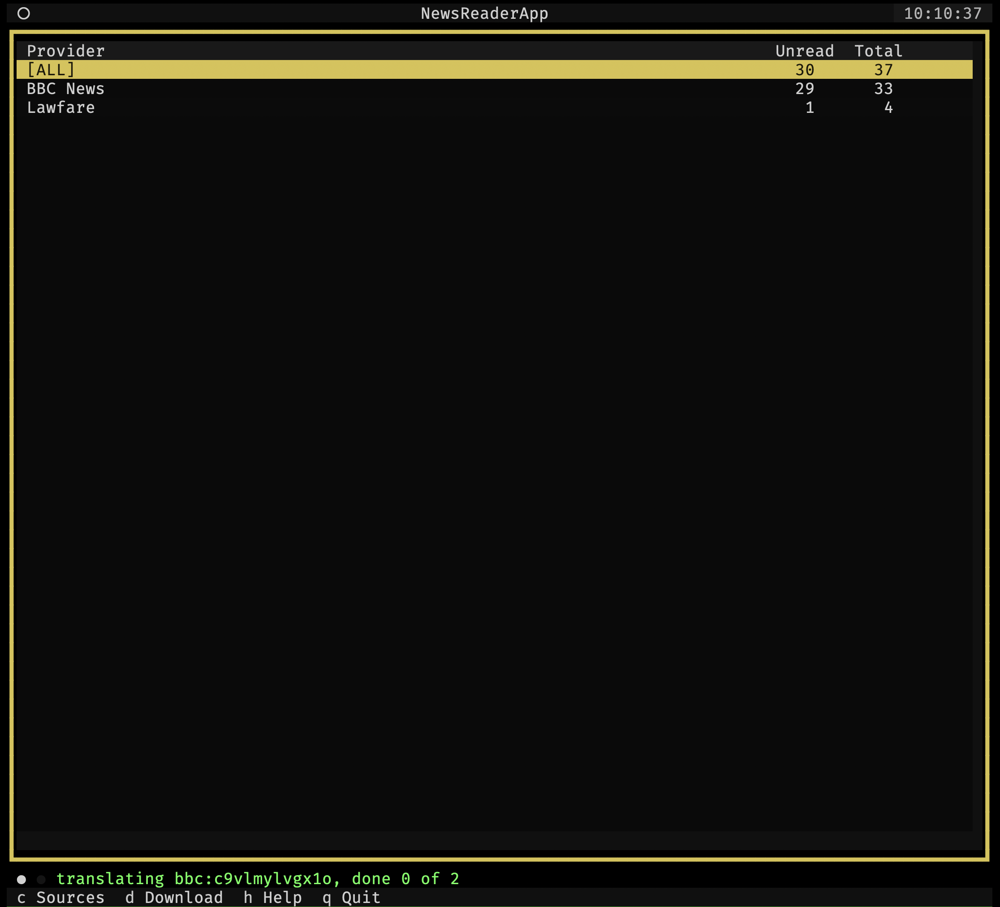
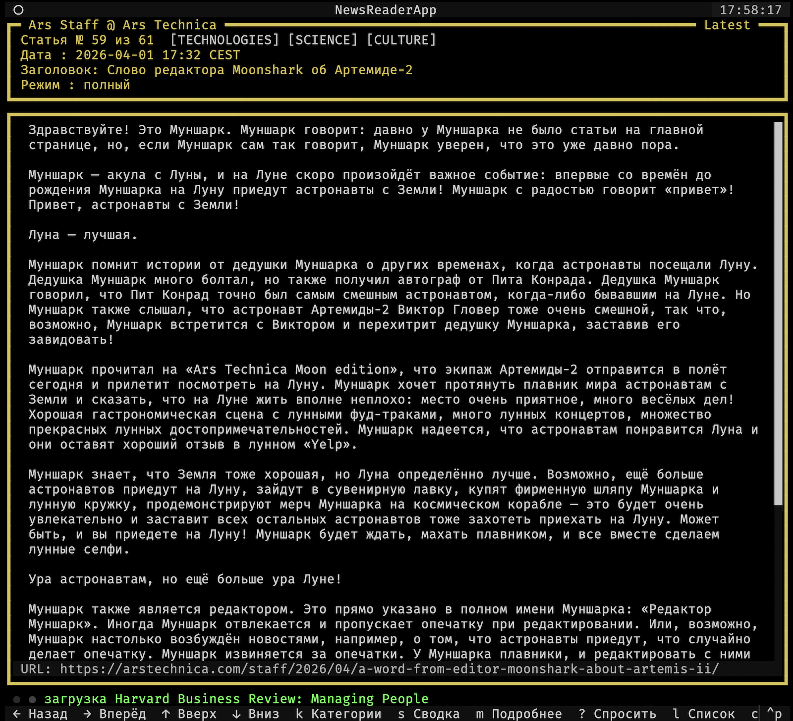
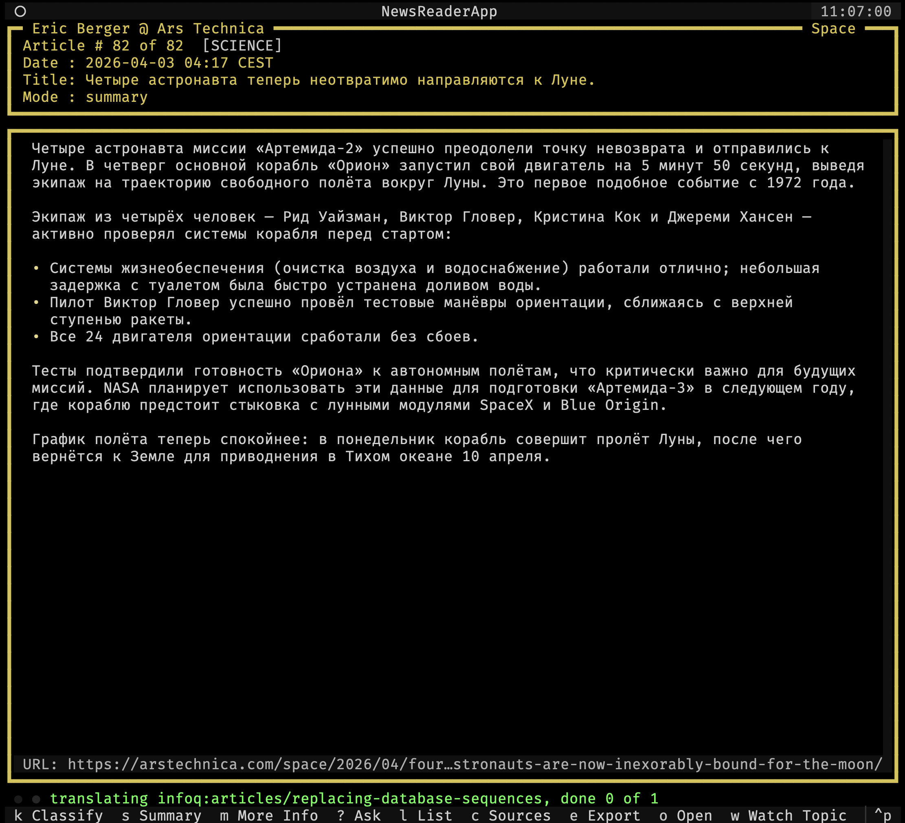
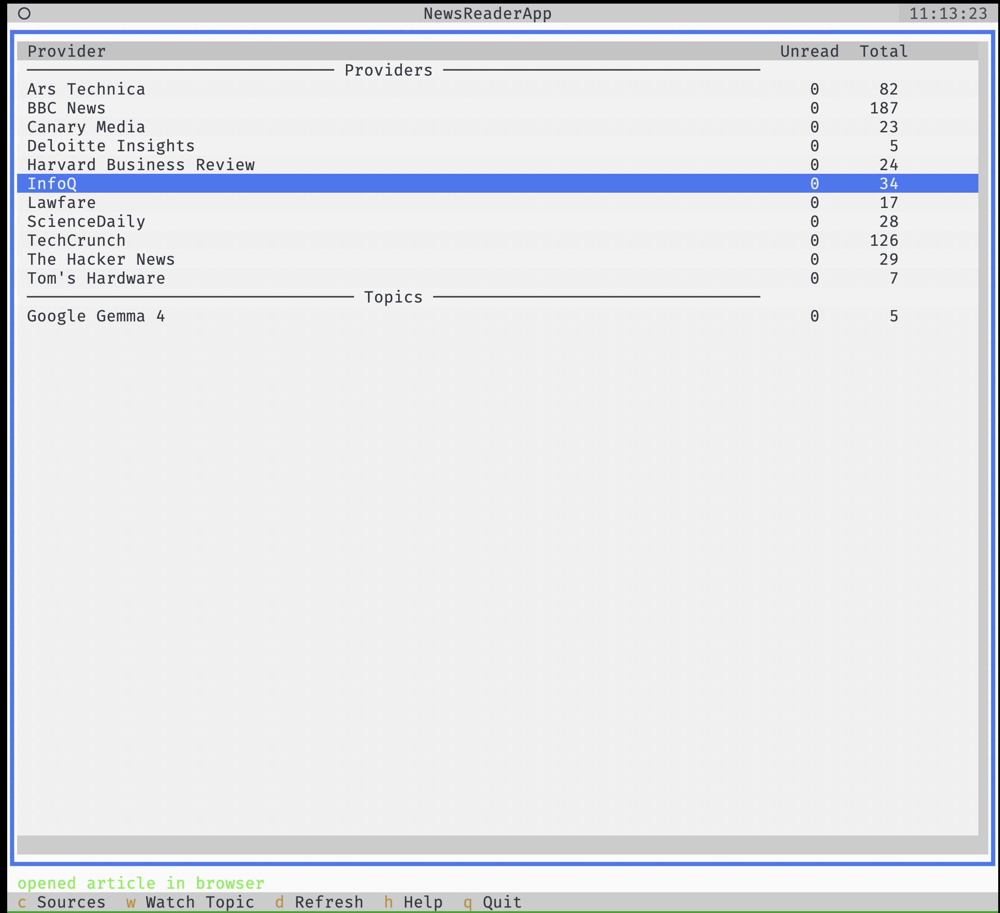
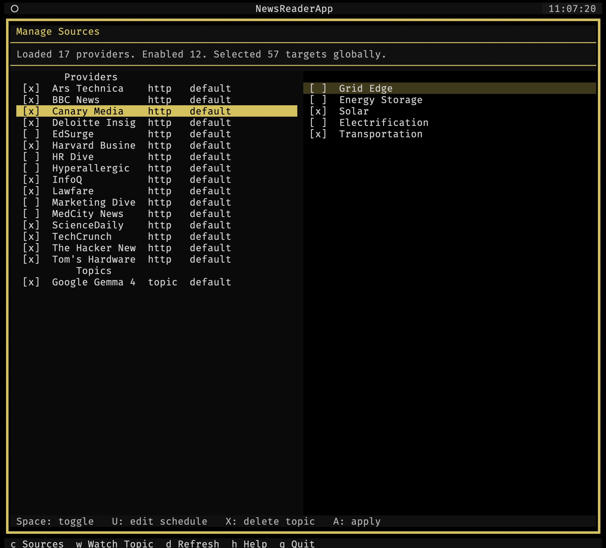
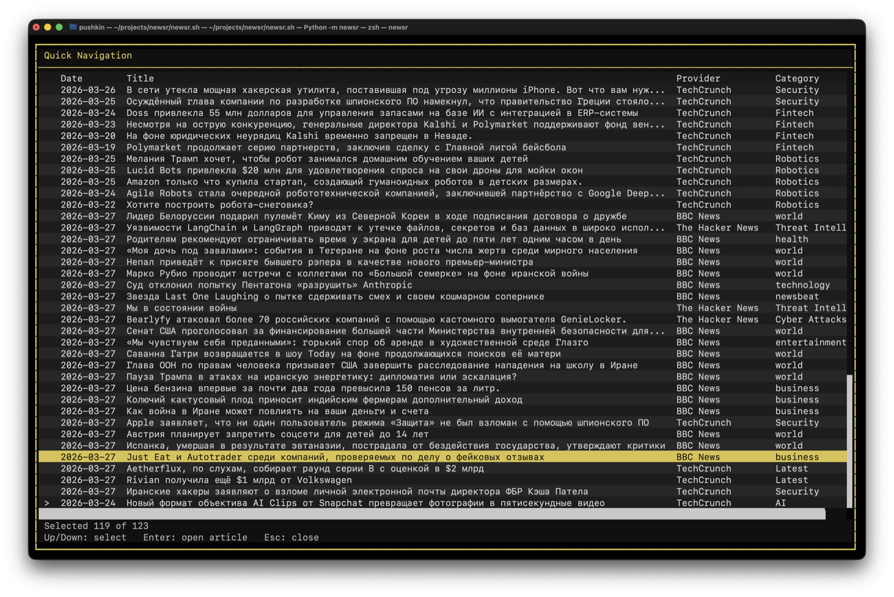
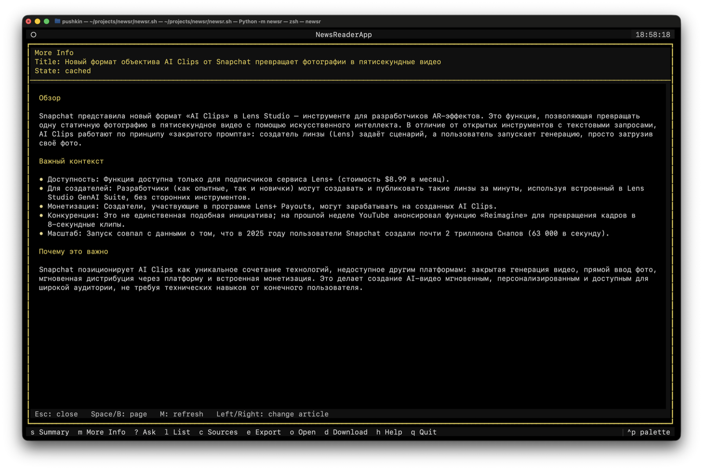
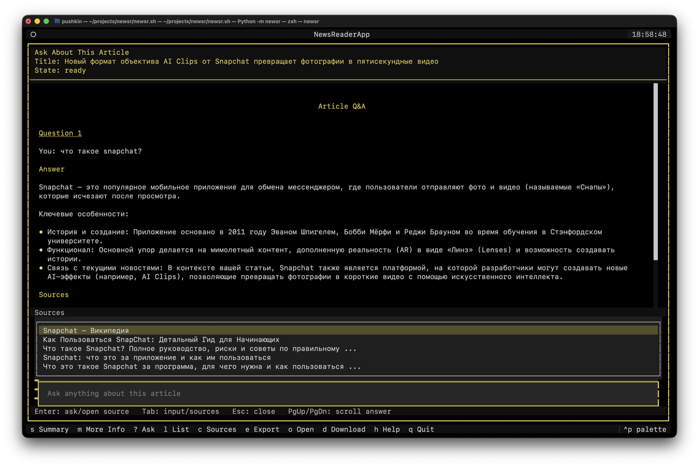

# NewsR

NewsR is a local-first terminal news reader with a provider-backed source model. It ships with multiple built-in news providers, translates full articles through an OpenAI-compatible LLM endpoint, stores local state in SQLite, and generates summaries for fast reading in a Textual UI. See [Current Providers](docs/current_providers.md) for the current built-in provider list and bootstrap defaults.

NewsR currently requires Python 3.12 or newer.

## Features

- built-in support for multiple news providers; see [Current Providers](docs/current_providers.md)
- cron-scheduled background refresh with LLM responsiveness preflight
- provider home with `[ALL]` plus enabled providers, unread/total counters, and configurable sort order
- watched topics that behave like virtual providers and can be created from provider home or the current article
- translated full articles plus summaries
- "more info" and article Q&A overlays backed by DuckDuckGo search and the configured LLM
- source management for enabling providers, editing schedules, refreshing catalogs, and choosing targets
- export of the current view as Markdown or PNG
- PNG and Markdown clipboard export support on supported platforms

## Screenshots

### Home Screen

Provider home on startup:



### Reading Views

Full article view:



Summary view:



Theme switch example:



### Navigation And Source Management

Manage sources:



Quick navigation:



### Contextual Overlays

"More info" overlay:



Article Q&A overlay:



## Setup

The simplest way to start NewsR from the repository root is:

```bash
./newsr.sh
```

`newsr.sh` uses the Python interpreter already available on your `PATH` (`python3` first, then `python`). If that interpreter is Python 3.12 or newer, the script creates `./venv` when needed, installs NewsR there, and launches the app.

If no compatible Python is available on `PATH`, the script exits with an error.

For development work, you can still create and manage the virtualenv manually:

```bash
python3 -m venv venv
source ./venv/bin/activate
pip install -e ".[dev]"
```

## Start The App

Run NewsR from the repository root so it can find `newsr.yml` and write runtime data under `cache/`.

```bash
./newsr.sh
```

You can also start it with:

```bash
newsr
```

or:

```bash
python -m newsr
```

On first launch, if `newsr.yml` is missing, NewsR starts a terminal setup flow before opening the Textual UI. The setup asks for:

- UI language, with a locale-based default from the built-in supported locales (`English` and `Русский`)
- `local` or `cloud` LLM backend
- an editable default URL for the chosen backend
- a suggested model name
- translation language, with a locale-based suggestion and an `English` fallback
- for cloud mode only: optional API key and optional extra headers

If `newsr.yml` already exists but is missing `ui.locale`, NewsR asks for the UI language before loading the rest of the config and saves the choice back into `newsr.yml`.

After writing `newsr.yml`, NewsR tells you that more settings can be tuned by editing the config file, then waits for Enter before launching the app.

To reconfigure the app from scratch, delete `newsr.yml` and start NewsR again. That reruns the terminal setup flow and writes a fresh config file.

After startup, NewsR opens the provider home. This is the app's home screen. `[ALL]` shows the cross-provider translated article stream, and each enabled provider gets its own row with unread and total counters. Press `Enter` to open a scope, and press `Esc` from the reader to return to the provider home.

The first launch also creates:

- `newsr.yml`: local config
- `cache/newsr.sqlite3`: source state, cached articles, summaries, and reader state
- `cache/newsr-llm.log`: LLM request log

The `exports/` directory is created on demand when you save a Markdown or PNG export.

## Configuration

The generated `newsr.yml` contains five sections:

- `articles`: how many article candidates to fetch per selected target, how many days of articles to keep in SQLite, and the default cron refresh schedule used when a provider has no override
- `llm`: the OpenAI-compatible base URL, optional auth settings, optional extra headers, plus a translation model for titles and article bodies and a summary model reused for summaries, "more info", search-query generation, and article Q&A
- `translation`: the target language used for translated headlines, article text, summaries, "more info", and article Q&A answers
- `ui`: the Textual UI locale, `[ALL]` visibility in provider home, and provider-home ordering; current built-in locales are `en` and `ru`
- `export`: image export settings

Example generated config for a local setup:

```yaml
articles:
  fetch: 5
  store: 10
  update_schedule: 0 * * * *
llm:
  url: http://localhost:8081/v1
  model_translation: local-translate
  model_summary: local-translate
  request_retries: 2
translation:
  target_language: English
ui:
  locale: en
  show-all: true
  provider_sort:
    primary: unread
    direction: desc
export:
  image:
    quality: fhd
```

`ui.provider_sort.primary` accepts `unread` or `name`.
`ui.provider_sort.direction` accepts `asc` or `desc`.
`ui.show-all` accepts `true` or `false` and controls whether `[ALL]` is shown in provider home.
`articles.update_schedule` accepts a standard 5-field cron expression and defaults to hourly refreshes.
`export.image.quality` accepts `hd` or `fhd`.
`llm.api_key` is optional for local unauthenticated servers. `llm.headers` can be used for extra OpenAI-compatible provider headers, and `llm.request_retries` controls how many times NewsR retries transient transport failures before surfacing an error.

Example cloud-specific additions:

```yaml
llm:
  url: https://api.openai.com/v1
  model_translation: gpt-4.1-mini
  model_summary: gpt-4.1-mini
  request_retries: 2
  api_key: sk-...
  headers:
    OpenAI-Organization: org-...
```

If you launch NewsR without an interactive terminal and `newsr.yml` is missing, startup fails with a message telling you to create the config file manually.

Source selection is managed in `cache/newsr.sqlite3`. Providers, discovered targets, and the current enabled and selected source state live there and are managed from the TUI.

## Provider Home

NewsR starts in a provider home view. This is the default home screen shown after setup and on every launch.

- `[ALL]` opens the shared reader across all enabled providers.
- Enabled providers appear under `[ALL]` with unread and total counters.
- Counters only include articles whose translation has completed.
- `Up` / `Down` / `PgUp` / `PgDn` / `B` move through the list.
- `Enter` opens the highlighted scope.
- `C`, `W`, `D`, `H`, `Ctrl+P`, and `Q` stay available from this view.

## Sources

Press `C` to open **Manage Sources**.

- The left pane lists registered providers and whether each one is enabled.
- Each provider row also shows its provider type and effective schedule source.
- The right pane lists targets for the currently highlighted provider.
- `Tab` switches panes.
- `Space` toggles the highlighted provider or target.
- `R` refreshes the highlighted provider's target catalog by calling its discovery flow.
- `U` edits the highlighted provider's cron schedule override. Leave it blank to use `articles.update_schedule`.
- `X` deletes the highlighted watched-topic provider.
- `A` saves the current source configuration.
- `Esc` closes the overlay without applying changes.

For the current built-in provider list, bootstrap defaults, and catalog behavior, see [Current Providers](docs/current_providers.md).

Saving source changes updates SQLite-backed provider state immediately. The scheduler and manual refresh actions use the latest saved configuration.

## Reader Controls

- `Left` / `Right`: previous or next article
- `Up` / `Down`: scroll by a few lines
- `PgUp` / `PgDn` / `B`: page scroll
- `Space`: page down, then move to the next article when already at the end
- `Esc`: return to the provider home
- `S`: toggle between full article and summary when a summary exists
- `M`: open or refresh the "more info" panel for the current article
- `?`: ask a follow-up question about the current article
- `L`: open the article list
- `C`: open source management
- `W`: create a watched topic from the current article
- `E`: open export actions for the current view
- `O`: open the current article in the system browser
- `D`: force-refresh the current provider, or all real providers when the current scope is `[ALL]`
- `Ctrl+P`: open the command palette and switch themes
- `H`: show the in-app help screen
- `Q`: quit

Press `Right` on the last article in the current scope to return to the provider home.

## Overlays

- `M` opens a "more info" overlay that uses DuckDuckGo search results plus the configured LLM to add context beyond the current article.
- `?` opens an article Q&A overlay where you can ask follow-up questions. NewsR also shows related public source links that you can open from the overlay.
- `L` opens quick navigation across translated articles.
- `C` opens the source manager for enabling providers and selecting targets.
- `E` opens the export screen, where you can use the buttons or `1` / `2` / `3` / `4` shortcuts for export actions.

## Export

Press `E` to export the current view. NewsR can:

- save PNG to `exports/`
- copy PNG to the system clipboard
- save Markdown to `exports/`
- copy Markdown to the system clipboard

Exports use the current article view, so summary mode exports the summary and full mode exports the full article body currently shown, preferring translated text when available. PNG exports also use the current Textual theme colors.
Saved export filenames include the local date, a slug derived from `article_id`, and the active mode (`full` or `summary`).

Clipboard export support depends on the platform:

- macOS: built in
- Windows: built in
- Linux: requires `wl-copy` or `xclip`

## Refresh Behavior

- Startup loads cached articles first and starts a minute-based scheduler loop for due providers.
- The provider-home counters update as translated articles become ready.
- Each enabled provider has a nullable `update_schedule`. When it is blank, NewsR uses `articles.update_schedule`.
- The scheduler checks once per minute for due providers and only starts a refresh when no other refresh or preflight is already running.
- `[ALL]` is a synthetic scope and is never refreshed directly.
- Pressing `D` starts an immediate forced refresh after the same lightweight LLM responsiveness preflight used by scheduled refreshes.
- Watched topics are fetched through a topic provider that searches the web, extracts readable article text, and sends new results through the same categorization, translation, and summary flow as built-in HTTP providers.
- Refresh work runs in the background and updates the UI as translations and summaries finish.
- Already cached articles are skipped before fetch and LLM work.
- Near the end of the article list, the app arms another fetch automatically so reading forward can pull in more content.
- Changing sources starts a new refresh immediately when no refresh is already running.

## Additional Documentation

- [Architecture](docs/architecture.md)
- [Adding A Provider](docs/add_provider.md)

## License

This project is licensed under the Apache License 2.0. See [LICENSE](LICENSE).
